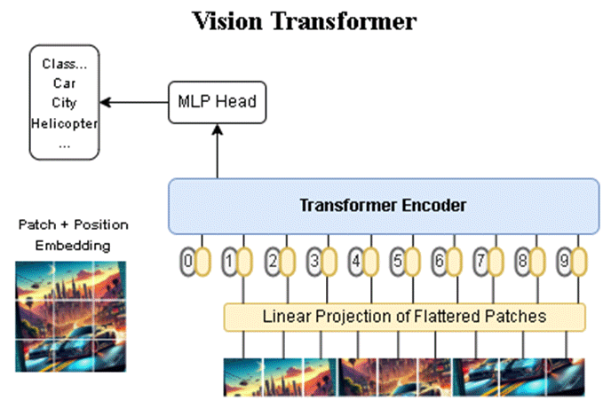
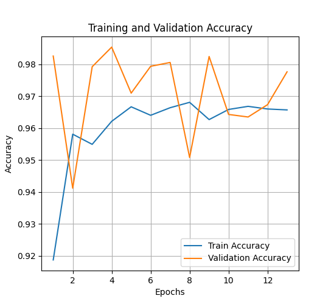
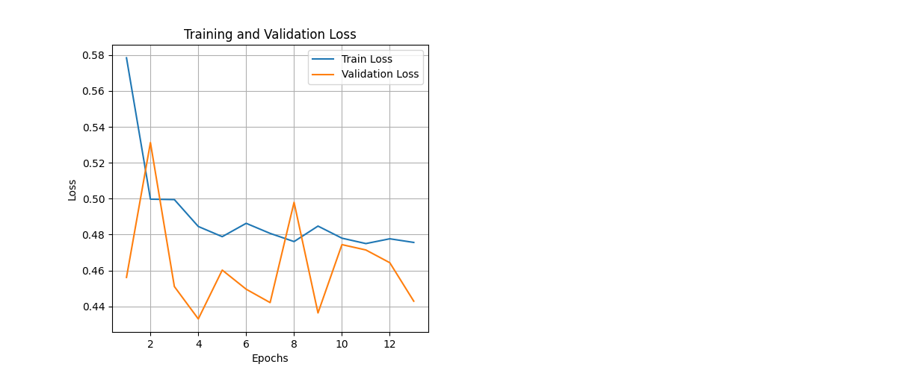
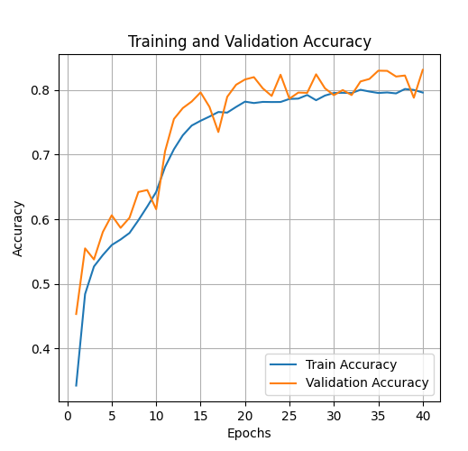
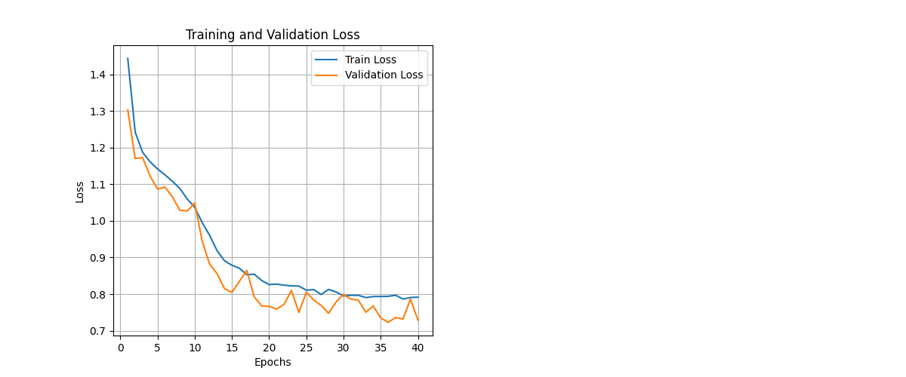
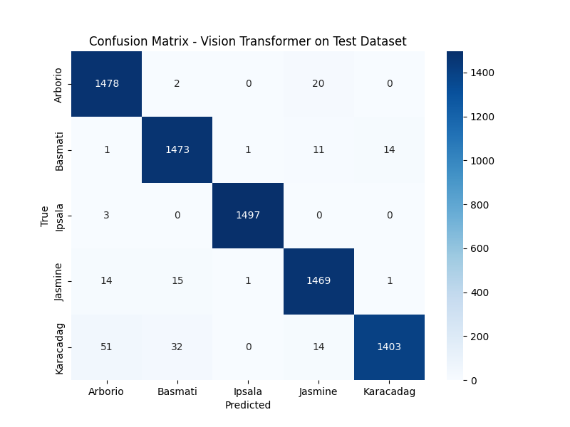
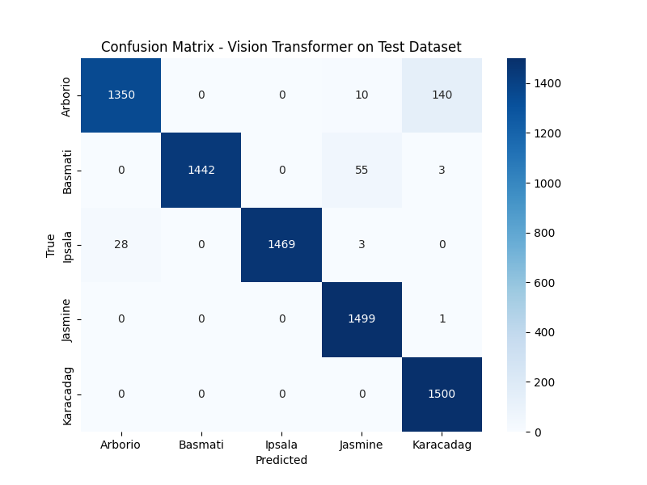
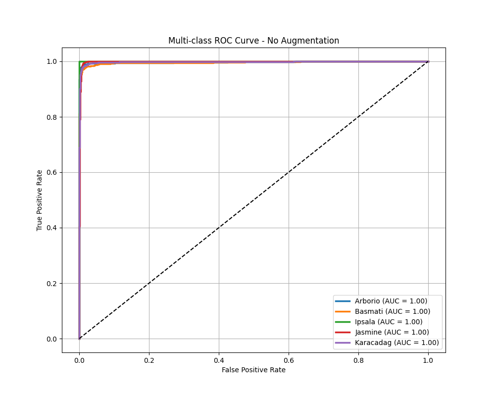
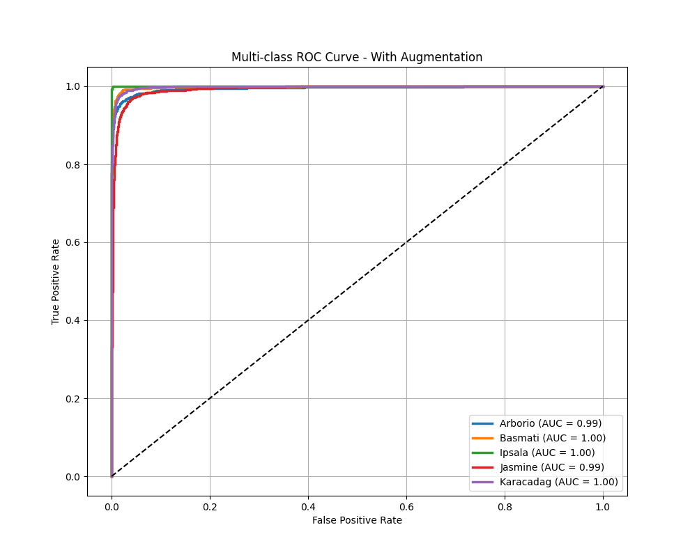

# Rice Identification Model using Vision Transformer

This repo is presenting the codes that used for training and testing the model that using deep learning. The dataset that used for this project is using rice dataset which included 75000 samples in 5 class.



The training process is using Vision Transformer Tiny for efficiency usage and with 50 epoch per train.

Each trains are attempted with different preprocessing settings :

### 1. No Augmentation (visions_no_augmentation.ipynb)

This train uses simple preprocessing settings that only resize, convert, and normalizing the dataset into train ready data.

```Python
transform = transforms.Compose([
    transforms.Resize(224),
    transforms.ToTensor(),
    transforms.Normalize(mean=[0.485, 0.456, 0.406],std=[0.229, 0.224, 0.225]),
])
```

### 2. With Augmentation (visions.ipynb)

The train uses advanced preprocessing settings that creates a random data state

```Python
transform = transforms.Compose([
    transforms.Resize(224),
    transforms.RandomHorizontalFlip(),
    transforms.RandomRotation(15),
    transforms.ColorJitter(brightness=0.4, contrast=0.4, saturation=0.4, hue=0.1),
    transforms.ToTensor(),
    transforms.Normalize(mean=[0.485, 0.456, 0.406],std=[0.229, 0.224, 0.225]),
    transforms.RandomErasing(p=0.5, scale=(0.02, 0.33), ratio=(0.3, 3.3), value=0, inplace=False) 
])
```

In the code, several augmentation methods are used for preprocessing.

**1. Transform.Resize()** : Resizes the sample images.

**2. Transform.RandomHorizontalFlip()** : Randomly flips the sample images horizontally.

**3. Transform.RandomRotation()** : Randomly rotates the sample images.

**4. Transform.ColorJitter()** : Modifies the color settings of the images input into the model.

**5. Transform.ToTensor()** : Converts the sample images into PyTorch Tensors so they can be processed during training.

**6. Transform.Normalize()** : Normalizes the image using a specified mean and standard deviation (std) to adjust the colors of the samples used in training.

**7. RandomErasing()** : Similar in function to Dropout, RandomErasing works by randomly erasing a portion of the pixels in the sample. 

## The Result

### Accuracy And Loss

Accuracy (No Augmentation)


Loss (No Augmentation)


Based on the results of the training process, training stopped at epoch 13 due to the Early Stopping mechanism to prevent overfitting. The results show that the model achieved an accuracy of up to 98% and a loss of 43%, indicating that the model trained effectively. However, the training results exhibit instability in the validation set, with scores occasionally spiking or dropping suddenly.

Accuracy (With Augmentation)


Loss (With Augmentation)


The training results obtained from the model using augmentation indicate that while the model’s scores declined, the training process proceeded smoothly without any sudden spikes in training or validation scores.

The final training results show that the model with augmentation stopped at epoch 40 due to Early Stopping to avoid overfitting; these Early Stopping results indicate that the model with augmentation is less prone to overfitting. The accuracy score for the model with augmentation was the highest at 83%, while the lowest loss score for the model was 72%. These results indicate that the model trained with augmentation achieved a lower score compared to the model without augmentation.

### Confusion Matrix

Confusion Matrix (No Augmentation)


Confusion Matrix (With Augmentation)


The confusion matrix results for the model without augmentation show that 7,322 samples were correctly detected, with an accuracy of up to 97.63%. The F1-score obtained in the test reached 0.97 (97%).

The Confusion Matrix results for the model using augmentation showed a decline in image prediction performance. A total of 7,039 samples were correctly predicted by the model using augmentation, with a test accuracy of up to 93.85% and an F1-Score of 0.93 (93%). The Confusion Matrix results also showed that some classes had lower prediction accuracy compared to the previous results.

### ROC Curves

ROC Curves (No Augmentation)


ROC Curves (With Augmentation)


The ROC curve results for the model without augmentation show that the model performs very well, with a score of 1.00 for all classes. Meanwhile, the results for the model using augmentation show a decrease in scores for the Arborio and Jasmine classes, both of which scored 0.99.

The implementation through Rice Identify Web Page can be found on this [Repository](https://github.com/adam-ghafara/rice-identify-flaskpage).